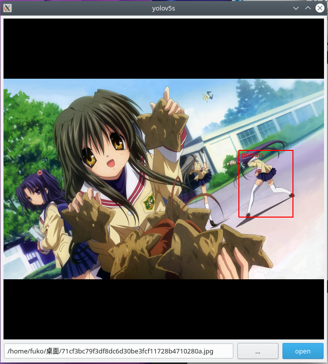

# yolov5s-ncnn

## 这个仓库是啥

我的假期实践课题之一，具体文档见 docs/yolov5s实践记录.md

## 以什么协议开源

受 [U 版 yolov5 仓库](https://github.com/ultralytics/yolov5) 的协议限制，本仓库的源码和模型均以 AGPL-3.0-or-later 协议发布

## 如何构建和测试

- 我的测试环境基于 debian 11 系统，你需要准备同为 debian 阵营的系统才能按我的步骤进行下去

- 使用 apt 安装 Qt5 相关的库，包括 qtbase5-dev，libqwt-qt5-dev 等基础开发环境

- 拉取 deepin 下的 NCNN 包，然后自行构建并安装，这个包位于 https://github.com/deepin-community/ncnn ，如果你正在使用 Deepin V20 系统，你可以直接执行命令 `sudo apt install libncnn-dev`

- 修改 yolov5s.cpp 里的模型和字典加载路径，将其改为你的目录地址

- 使用 cmake 或者 Qt Creator 或其它你喜欢的工具执行构建和测试即可

## 效果图

